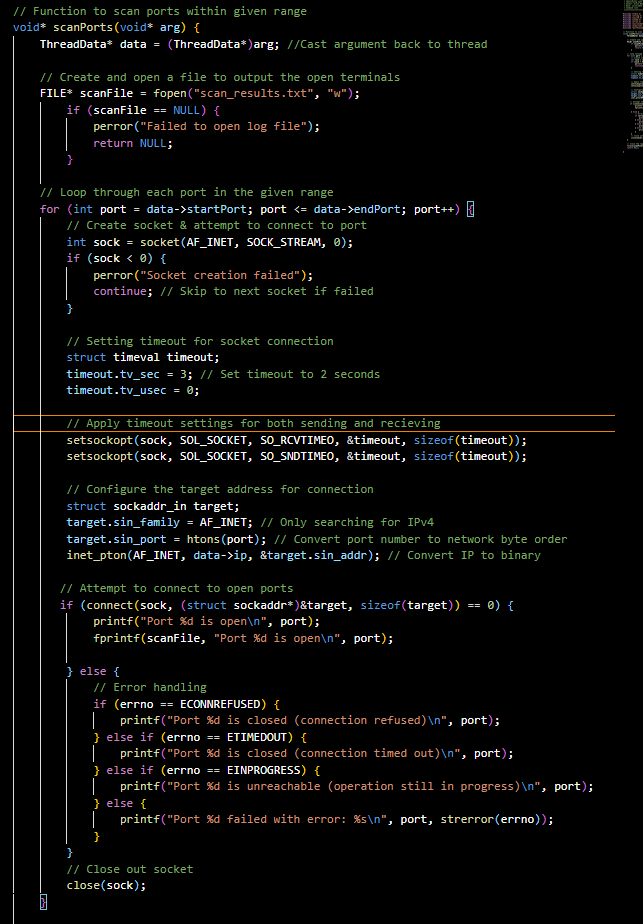

# Multi-threaded Port Scanner

- **Name:** Alion Bujku
- **Assignment:** System Programming Lab 13 Port Scanner
- **Section Number:** 111
- **Date:** 12/11/2024

## Description
This project implements a multi-threaded port scanner in C. It takes a hostname or IP 
address, a range of ports, and the number of threads as inputs and identifies open ports
on the specified host. The program is divided into the following files:

- **portMain.c**: Handles user input, resolves the hostname to an IP address, and manage threads.
- **portScanner.c**: Contains the logic for scanning ports
- **portScanner.h**: Header file defining structures and function prototypes.

## Features
- Resolves a hostname to an IP address
- Divides port scanning tasks across multiple threads for efficiency
- Outputs open ports to the console and a log file ('scan_results.txt')

## Usage
### Compilation 
Use the provided 'Makefile' to compile the project:
```
make
```
## Running the Program
```
./portScanner <hostname> <start_port> <end_port> <num_threads>
```
* `<hostname>`: The target hostname or IP address
* `<start_port>`: Starting port number
* `<end_port>`: Ending port number
* `<num_threads>`: Number of threads to use for scanning

### Example
```
./portScanner example.com 20 80 4
```

## How does the code work?
The logic for scanning the ports is implemented in `portScanner.c`. 
1. Thread Data Structute: I defined a structure called `ThreadData` to hold the IP address and range of ports scanned by each thread.
2. The function `scanPorts` scans a subset of ports. It creates a socket for each port using `socket(AF_INET, SOCK_STREAM, 0)`. A connection attempt is then made using `connect()` and will return if the port is either open, closed, or unreachable.

3. The outputs are printed out on the command line and a file is created with all the
ports that were open.

## Authors
* Alion Bujku